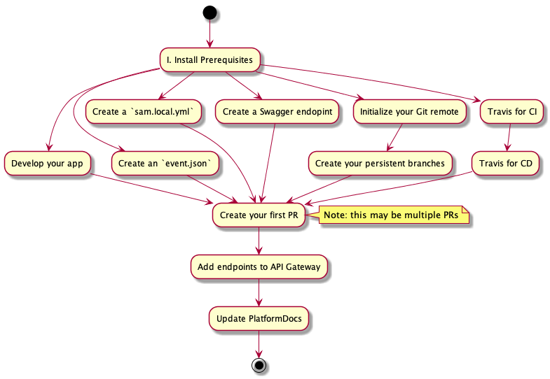

# Adding an Endpoint to the Platform API

This document describes, step by step, how to add an endpoint to the Platform API. For the following, we'll assume you'll be using [AWS Lambda](https://aws.amazon.com/lambda/) to serve your code as it's cheap, versatile, and supports Ruby and Node natively.

Note that the order of some of these steps is sometimes flexible; The strict dependency graph is:


## I. Install Prerequesites

### A. [Install the AWS CLI](https://docs.aws.amazon.com/serverless-application-model/latest/developerguide/serverless-sam-cli-install-mac.html#serverless-sam-cli-install-mac-aws-cli)

Ensure you have an AWS CLI "profile" named `nypl-digital-dev`. You're encouraged to not use a default profile (i.e. all `aws` calls should require an explicit `--profile` flag). For example, a good starting `~/.aws/credentials` might be:

```
[nypl-digital-dev]
aws_access_key_id = [your access key here]
aws_secret_access_key = [your secret key here]
```

### B. [Install Docker](https://docs.aws.amazon.com/serverless-application-model/latest/developerguide/serverless-sam-cli-install-mac.html#serverless-sam-cli-install-mac-docker)

You'll need Docker for local SAM invocations, which allow you to run your code in an emulated Lambda environment.

### C. [Install SAM CLI](https://docs.aws.amazon.com/serverless-application-model/latest/developerguide/serverless-sam-cli-install-mac.html#serverless-sam-cli-install-mac-sam-cli)

You'll use `sam` to run ad-hoc tests of your code. It's also possible to deploy via `sam`, but that's not our practice.

### D. Install your Ruby/Node version manager

Make sure you have [`nvm`](https://github.com/nvm-sh/nvm#install--update-script) or [`rvm`](https://rvm.io/rvm/install) intalled for Node and Ruby, respectively

## II. Write your app

What code you write first depends on your app and coding style, but getting a basic, testable environment at the start may help you later.

Note: If you're in the habit of committing often (which you should be), you should initialize non-`master` branch for your first commits: After running `git init`, create a new initial branch via `git checkout -b initial`. Make your commits into `initial`. That way, when it comes time to have your initial code reviewed, you can create a PR merging `initial` into `development` (or whatever your PR target branch is).

### A. Create an `event.json`

Create an `event.json` that exemplifies a request to your endpoint. You may wish to create multiple event JSONs organized in `./sample-events`. `sam` provides a command to generate events modeling HTTP requests through the API Gateway.

```
# Generate an event modeling a simple incoming GET:
sam local generate-event apigateway aws-proxy --path api/v0.1/path-to-your-endpoint --method GET > event.json

# Generate an event modeling an incoming HTTP POST:
sam local generate-event apigateway aws-proxy --path api/v0.1/path-to-your-endpoint --method POST --body "{ \"barcodes\": [ \"01234567891011\" ], \"user_email\": \"email@example.com\"}" > event.json
```

For more info:

```
sam local generate-event apigateway aws-proxy --help
```

### B. Create a `sam.local.yml`

A [SAM template](https://github.com/awslabs/serverless-application-model/blob/master/versions/2016-10-31.md) describes your app's endpoints in a vendor agnostic form. SAM template files are also helpful for doing local, ad-hoc testing.

Although you can use `sam init` to generate your `sam.local.yml`, you can also just copy and modify the following into `sam.local.yml`:

```
AWSTemplateFormatVersion: '2010-09-09'
Transform: AWS::Serverless-2016-10-31
Description: 'sync-item-metadata-to-scsb-service'

Resources:
  NameOfYourService:
    Type: AWS::Serverless::Function
    Properties:
      Handler: app.handle_event
      Runtime: ruby2.5
      Timeout: 10
      Environment:
        Variables:
          LOG_LEVEL: debug
      Events:
        Api1:
          Type: Api
          Properties:
            Path: "/{proxy+}"
            Method: ANY
```

Things you may wish to change:
 * Resource name: Change "NameOfYourService" to an appropriate name (typically a upper-camel-case form of your repository name)
 * Runtime: Note the [available AWS lambda runtimes](https://docs.aws.amazon.com/lambda/latest/dg/lambda-runtimes.html)
 * Environment > Variables: Add environmental variables as required. Above we've just set `LOG_LEVEL=debug`.
 * Handler: This specifies what file and function name to pass incoming events to. A file named "app" (i.e. "app.js" or "app.rb") is a common choice. A function called "handle_event" is a common choice for the function.

Make sure your choice of runtime agrees with your local Node/Ruby version:
* If using Ruby:
  - Select version `2.5.0` as that's [the max runtime supported in AWS Lambda](https://docs.aws.amazon.com/lambda/latest/dg/lambda-runtimes.html)
  - Officially declare your choice of ruby version in your repo via `echo "2.5.0" > .ruby-version`
  - Ensure you're using the declared ruby version via `rvm use`, which will read your `.ruby-version`
* If using Node:
  - Select either Node version `8.10.0` or `10.16.3` depending on your requirements. (Better to choose the latest until you have a reason not to.)
  - Officially declare your choice of Node version in your repo by adding it to `.nvmrc`
  - Ensure you're using the declared Node version via `nvm use`, which will read your `.nvmrc`

### C. Develop your app

Develop your app until your local test suite passes and you get a satisfactory response to a sample event.

To simulate invoking your app against arbitrary HTTP requests - assuming you've created an `event.json` as described above - run the following:

```
sam local invoke --event event.json --region us-east-1 --template sam.local.yml --profile nypl-digital-dev
```

The above call should produce an object modeling the HTTP response. See [AWS documentation on responses for more info](https://docs.aws.amazon.com/apigateway/latest/developerguide/api-gateway-integration-settings-integration-response.html) At a minimum, it should resemble:

```
{
    statusCode: "...",  // A HTTP status code, e.g. 200, 400
    body: "..."         // The body of the response (typically stringified JSON)
}
```

You can further test your code by spinning up a local server:

```
sam local start-api --region us-east-1 --template sam.local.yml --profile nypl-digital-dev
```

Note that - if using Ruby - you may have to package your dependencies as a deployment via `bundle install --deployment` to use above `sam` calls.

The ad-hoc testing above should not replace a comprehensive test suite. In addition to targetted unit testing, you should also test the front-door (i.e. configured "Handler") to confirm, for example, that when required parameters are invalid, appropriate `4xx` responses are returned and communicative `5xx` responses are returned for internal issues or failed external dependencies. For example, [IsResearchService test the event handler directly](https://github.com/NYPL/is-research-service/blob/development/spec/unit/app_spec.rb).

#### App config

As you develop your app, you'll likely collect a few values that you want to vary between deployments. Those should be added to your `sam.local.yml` under `Environment > Variables`.

For *secret* config variables (e.g. database connection strings, credentials), regardless of your repo's private/public status, you'll want to encrypt them. We use KMS. You can use KMS [directly via the AWS CLI](https://github.com/NYPL/engineering-general/blob/8afa65f3af28654159f11b5b1ac91dde5812153e/security/secrets.md#encryptingdecrypting) or you can use our [kms-util](https://github.com/NYPL-discovery/kms-util).

If your app needs to connect to other Platform API resources, your app will need its own dedicated Platform API credentials. Talk to a co-worker for assistance. Note that Platform API credentials, being secrets, should be encrypted before placing them anywhere in your codebase.

Encrypted environmental variables will need to be decrypted by your app, naturally. This tends to be done using wrapper classes around language specific AWS SDKs. Some examples:
 * SyncItemMetadataToSCSBService (Ruby) [uses an encrypted `SQS_QUEUE_URL`](https://github.com/NYPL/sync-item-metadata-to-scsb-service/blob/31e4553823f766a68ac87cb4f5f9d2aaa6946b14/lib/sqs_client.rb#L7), which uses a simple [`KmsClient`](https://github.com/NYPL/sync-item-metadata-to-scsb-service/blob/master/lib/kms_client.rb) for decryption.
 * DiscoveryApiIndexer (Node) uses a [KmsHelper module](https://github.com/NYPL-discovery/discovery-api-indexer/blob/master/lib/kms-helper.js) to provide two Promise-returning calls to decrypt environmental variables.

### D. Create a Swagger endpoint

All endpoints in the Platform API must be described in a [Swagger](https://swagger.io/) document. Each app is responsible for serving its own Swagger document describing each of its endpoints (except the endpoint that serves the Swagger document itself). Typically an app will listen for GET requests on "/docs/APPNAME". The value of APPNAME tends to be the app's repository name (minus "-service", because it's redundant). For example:

 * BibService serves its Swagger doc from `/docs/bib`
 * SyncItemMetadataToSCSBService serves its Swagger doc from `/docs/sync-item-metadata-to-scsb`

The document served from those endpoints should be a valid* Swagger (i.e. [Open API Specification v2](https://swagger.io/specification/v2/)) document. It should include a definition for each of your paths including response definitions. It's common to store an app's Swagger document as a static JSON and/or YML in the root of the app.

To understand how to write a Swagger document, you may choose some combination of the following:
 * Read/skim the [Open API Specification](https://swagger.io/specification/v2/)
 * Use [the Swagger online editor](https://editor.swagger.io/), which will tell you when you've misstepped.
 * Use an existing app's swagger as a basis (e.g. [a GET endpoint](https://github.com/NYPL/is-research-service/blob/development/swagger.yaml), [a POST endpoint](https://github.com/NYPL/sync-item-metadata-to-scsb-service/blob/master/swagger.yml), [an app with both](https://github.com/NYPL/book-lists-service/blob/master/swagger.v0.1.json))

\* You may notice Swagger validation errors if you add a `security` section to an endpoint that references "api_auth", a [security definition](https://swagger.io/specification/v2/#securityDefinitionsObject) that's not defined inside your Swagger document. Provided the you reference "api_auth", you can ignore the warning; The referenced security definition will be defined when your Swagger document is merged with the greater, aggregated Platform API Swagger document.

### E. Initialize your Git Remote

[Create a new repo](https://github.com/organizations/NYPL/repositories/new) on Github.com.

Your respository name should:
 * clearly identify the purpose of your service
 * use ["Kebab case"](https://en.wikipedia.org/wiki/Letter_case#Special_case_styles)
 * end in "service"
 
Your repo should be public unless there's a very good reason to make it private (e.g. it includes third-party proprietary data/code).

It's useful to leave your remote repository empty to start.

### F. Create your persistent branches

You should also use github.com to create your persistent workflow branches. Depending on what [Git Workflow](https://github.com/NYPL/engineering-general/blob/git-workflows/standards/git-workflow.md) you choose for your app, you will need to create 1-2 workflow branches.https://github.com/NYPL/engineering-general/tree/git-workflows). For example, if you choose ["Development-QA-Master"](https://github.com/NYPL/engineering-general/blob/git-workflows/standards/git-workflow.md#development-qa-master), the most popular strategy among NYPL apps, you'll want to create "development" and "qa" branches.

To create an empty branch on github.com:
1. Go to your repo on github.com
1. Select the "Branch:" drop-down
1. Type your new branch name (e.g. "development")
1. Select "Create branch: development"

## III. Enable Travis

Once the local version of your app is somewhat mature, you'll want to get [Travis](https://travis-ci.com/) set up to begin moving versions of your work into your presently empty remote repository. Travis will listen for all pushes to github.com to ensure your test suite passes for all new branches and pull requests ("CI"). Travis will also listen for updates to specific branches to deploy your code ("CD").

### A. Travis for CI (Continuous Integration)

Create a `.travis.yml` in your app. You can either read [our synopsis](https://github.com/NYPL/engineering-general/blob/master/standards/travis-ci.md), follow the [Travis CI Tutorial](https://docs.travis-ci.com/user/tutorial/), or just copy and modify from an existing [Ruby](https://github.com/NYPL/is-research-service/blob/development/.travis.yml) or [Node](https://github.com/NYPL-discovery/discovery-front-end/blob/development/.travis.yml) app. (If copying from an existing app, don't include the `deploy` and `env` sections as those are only relevant to CD.

Commit your `.travis.yml` to your working branch - along with any other uncommitted code. (The first time you push to `origin`, take extra care that you not commit anything transient (e.g. dependency directories like `node_modules` & `vendor`, logs, temporary files) nor any unencrypted secrets. Have a co-worker look through your code to be sure.

Push your working branch to origin (e.g. `git push origin initial`). You can then visit [travis-ci](https://travis-ci.com/) (you may have to authorize via Github if this is your first visit). Within a minute or so you should see your app appear under "My Repositories". You should see it building and running your test suite against your pushed branch.

### B. Travis for CD (Continuous Deployment)

Once you have a working Travis CI integration, you'll want to test deployment. Again, we provide a [helpful synopsis](https://github.com/NYPL/engineering-general/blob/master/standards/travis-ci.md#deploy), or you can review the [relevant Travis CI documentation](https://docs.travis-ci.com/user/deployment/lambda/). You can also just copy and modify from a [representative repo](https://github.com/NYPL/is-research-service/blob/development/.travis.yml).

Take special care with the following properties of your deployments:

 * `function_name`: This should be an upper-camel-case form of your repo name ending in a suffix identifying the environment (e.g. "-qa", "-production"
 * `description`: This may/should match your remote repo description.
 * `runtime`: This should be [an official AWS Lambda runtime identifier](https://docs.aws.amazon.com/lambda/latest/dg/lambda-runtimes.html)
 * `module_name`: This should be the basename of your front-door script (e.g. "app")
 * `handler_name`: This is the name of function inside yoru front-door script that is passed the event (e.g. "handle_event")
 * `environment_variables`: These are the config vars for the given deployment. These should align with the `Environment > Variables` in your `sam.local.yml` (however note they should be formatted `KEY=VALUE` rather than `KEY: VALUE`)
 * `access_key_id` & `secret_access_key`: These are the AWS credentials that Travis will use to deploy. *They should not be entered manually*. You should [use shell variables](https://github.com/NYPL/is-research-service/blob/0942eedc901de127a8b4ac5789d90d9c1460bfd0/.travis.yml#L28-L29).
 * `on`: This is the bit that determines what branches trigger deployments. In practice only "qa" and "master" (or "production") ever trigger deployments. 

Now you'll need to add some encrypted variables, which will ultimately manifest as `AWS_ACCESS_KEY_ID_*` and `AWS_SECRET_ACCESS_KEY_*` variables. If your `.travis.yml` has a `env` section at the bottom (i.e. copied from another repo), remove it now. Follow the instructions under [Deploy](https://github.com/NYPL/engineering-general/blob/master/standards/travis-ci.md#deploy) to insert three new encrypted variables into your `.travis.yml` under `env`.

Commit your changes and push to your initial branch.

## IV. Deploy

Deployment consists of 1. triggering Travis to package up your code as a Lambda function in AWS and 2) configuring the API Gateway to trigger your function on select endpoints.

### A. Create your first PR

Go to your app's repo on github.com to create a new pull request proposing merging your initial branch (e.g. "initial") into your lowest tier persistent branch (e.g. "development"). Add a description that captures all of the things that work and all of the things that don't yet. Add your favorite co-workers as reviewers.

After review passes, merge your PR. Depending on your chosen Git Workflow, you may then wish to merge to the "qa" branch. Do so manually (i.e. on the command line) and push to `origin`. You should find that Travis runs your test suite and attempts to deploy your app to QA. If anything about the deployment fails (it often does the first time), adjust your `.travis.yml` as needed and commit directly into your "qa" branch until it succeeds. (Follow up by merging your "qa" branch back into your lowest tier branch - e.g. "development" - to ensure feature branches include your fixes.)

### B. Add endpoints to API Gateway

Your code is now deployed, but it's not listening to any event triggers. To allow your code to be triggered by calls to endpoints on `platform.nypl.org` and `qa-platform.nypl.org`, you need to connect your Lambda to a resource and method in API Gateway:

* Log into the [AWS Console and navigate to "API Gateway"](https://console.aws.amazon.com/apigateway/home?region=us-east-1#/apis)
* Select "Platform" (our sole API at writing)
* Under Resources, select the nested resource that you want to hang your endpoint off of
* If adding a new path (e.g. if "api/v0.1/recap" exists and you want to add "api/v0.1/recap/new-path"), select "recap" (the terminal, existing path) and choose `Actions > Create Resource`
* With the resource selected, choose `Actions > Create Method` (After clicking, you may have to scroll back down to the resource to proceed.)
* Choose the HTTP method you'd like to add and click the little gray checkmark. (You may have to scroll all the way back up to proceed.)
* Set up your integration:
  * Integration type: "Lambda function" (default)
  * Use Lambda Proxy Integration: **enabled**
  * Lambda Region: us-east-1 (default)
  * Lambda Function: Enter the name of your lambda. Replace the "-qa" part with "-${stageVariables.environment}"
  * Use Default Timeout: enabled (default)
  * Click Save
  * The interface will alert you to an extra step that's required to authorize the API Gateway to connect to your resource. Read [this document](https://github.com/NYPL/aws/blob/master/common/apigateway.md) to understand what to do with the suggested call.
* To force consumers to authenticate calls to your endpoint (almost all do)
  * On the "Method Execution" page for the method you've just added, click "Method Request"
  * Change Authorization to "nyplAuthorizerInternal"

Repeat above to add a GET endpoint for your app's swagger endpoint (e.g. "/docs/bibs"). *Do not* add an authentication requirement to your swagger endpoint.

Test your changes by:
 * Navigate to the Method Execution page for each route you've added
 * Select "Test"
 * Enter either "qa" or "production in `Stage Variables > environment`
 * Click Test
 * You should see the expected HTTP Status and Body. If something fails, you "Status: 200" and a "Response Body"

Once you're satisfied that you've wired up the integration correctly, you'll need to "deploy" your API Gateway changes:

 * With the "Platform" API selected
 * Select Actions > Deploy API
 * Select Deployment Stage "qa"
 * Enter a brief description of the change (e.g. "Add MyService endpoints)
 * Click Deploy

This will cause your changes to be immediately available for the selected "qa" Deployment Stage.

### C. Update PlatformDocs

By "deploying" to the "qa" stage of the API Gateway, you should be able to fetch your app's Swagger document. For example, here's the unauthenticated URL of the Swagger document for the SyncItemMetadataToScsb:

```
https://qa-platform.nypl.org/docs/sync-item-metadata-to-scsb
```

Follow the [instructions to add your app's Swagger document to PlatformDocs](./update_platformdocs.md#swagger-json)

